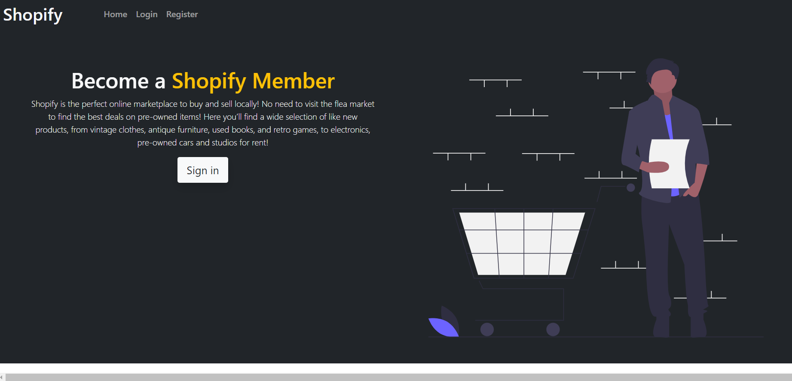
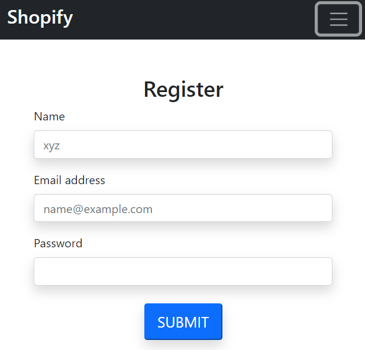
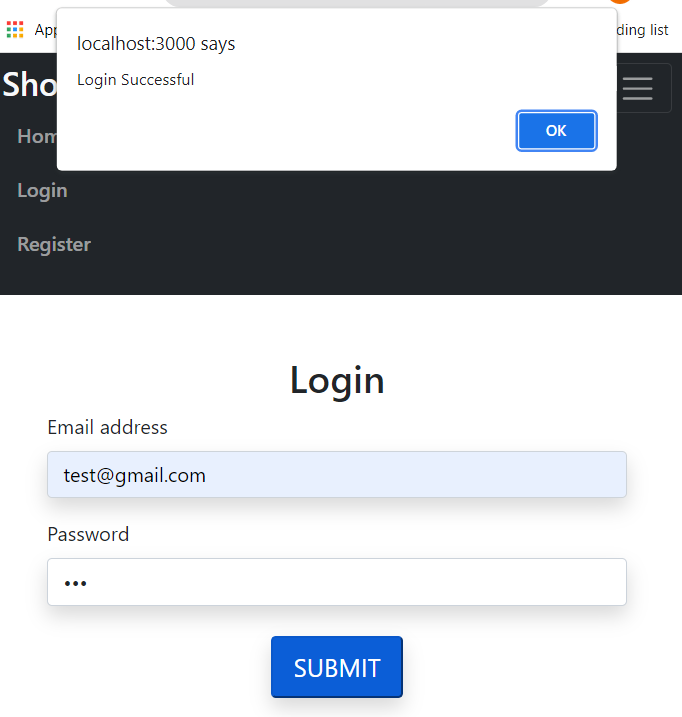
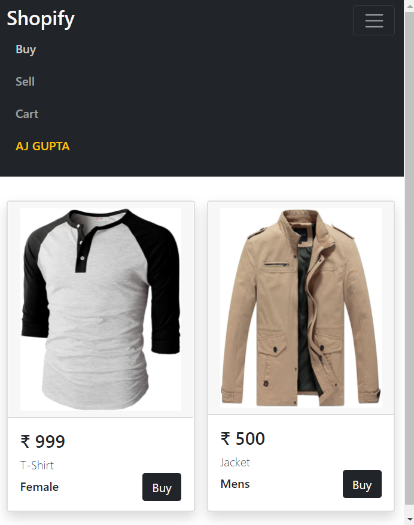
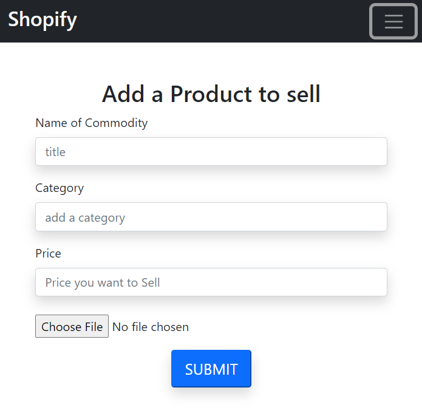
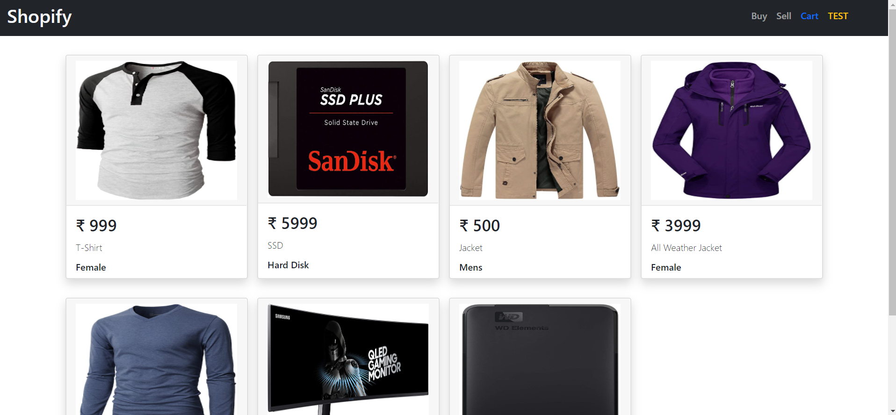

# SHOPIFY

    > Built a fully responsive Nodejs and Reactjs based web-service on which user's can buy and sell products or used commodities
### Tech stack used
    > Reactjs
    > Nodejs
    > Redux (for global state management)
    > MongoDB as database
    > Bootstrap (for UI/UX design)
    > React - Router
    > J.s - cookies
    > Jwt web token

### Local Setup & Installation
Open terminal and run the following command:

### Requirements 
```
 * Nodejs
 * Express
 * Reactjs
 * MongoDB
```
### BackEnd

 - #### Backend Installation
 ```
 $ cd server
 $ npm install
 ```
 - #### Run Backend
 ```
  $ npm start
 ```
 Command Prompt will show the following message:
 ```
[nodemon] starting `node index.js`
Example app listening at http://localhost:5000
conneted to mongo successfully
 ```

### FrontEnd
 - #### Front End Installation
 ```
 $ cd client 
 $ npm install
 ```
- #### Run Front End
```
$ npm start
```
Command Prompt will show the following message
```
Compiled successfully!

You can now view client in the browser.

  Local:            http://localhost:3000
  On Your Network:  http://192.168.43.47:3000

Note that the development build is not optimized.
To create a production build, use npm run build.
```

In the server/.env file go ahead and paste your mongodb Atlas connection string after intiliating a mongoDb instance as -
```
CONNECTION_URL=mongodb+srv://<user_name>:<password>@cluster0.jlsso.mongodb.net/myFirstDatabase?retryWrites=true&w=majority
```
or Paste your local mongodb string as
```
connection_url=mongodb://localhost:27017/olx-clone
```

After intiliating both the FrontEnd and BackEnd 

<h3 align="center">
   <b>Home Page</b>
</h3>

<p align="center">
  
</p>

<h3 align="center">
     <b>Registeration Page</b>
</h3>

<p align="center">
  
</p>

<h3 align="center">
   <b>Login Page</b>
</h3>

<p align="center">
  
</p>

Example Login ID:
```
Email: test@gmail.com
password: aaa
```
Upon logging in-
* We can sell a product by visiting Sell section
* We can purchase a product by vising Buy Section
* After buying a product it will be deleted from seller's list and added to cart of user
* If a user add a product by selling it then he/she cannot sell it to themselves hence the application will not show the newly added product to Seller's Buy Section
* We can purchase a product which is being sold by another user (Like original Olx App <b>;-)</b>  )

<h3 align="center">
   <b>Buy a Product</b>
</h3>

<p align="center">
  
</p>

<h3 align="center">
   <b>Sell a Product</b>
</h3>

<p align="center">
    Seller can add required information and upload an image to market their product on sale
</p>

<p align="center">
  
</p>

<h3 align="center">
   <b>User's Cart</b>
</h3>

<p align="center">
  
</p>

### Scope of improvement 
* Animations and Designs can be added to home page
* UI /UX of website of the application can be upgraded throughly
* Security can be improved by adding tech stack like byCrypt ,google authentication etc
* A session could be maintained by including js-cookie module which will let any user to remain logged in for longer periods of time

### Made by
<hr/>
<table>
<td>
    <p align="center">
 <a align="center" href="https://github.com/Ajasra22">
 
         <br />
         <sub>
            <b>Ajasra Gupta</b>
         </sub>
 </a>
     </p>
 <br/>
 </td>
 </table>
